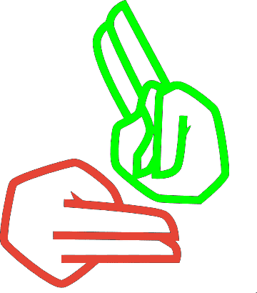

  

  <h1>Sign Language Translator</h1>

---

The Sign Language Translator is an open-source project developing an AI-powered tool for real-time sign language translation. It invites contributors to improve accuracy and accessibility, helping the deaf and hard-of-hearing community. Join us in advancing inclusively through AI and collaboration.

## 📚 Research Papers

| Year | Title                                                                                      | Paper Link                                                                                                                                           | GitHub Repository                                                                 |
| ---- | ------------------------------------------------------------------------------------------ | ---------------------------------------------------------------------------------------------------------------------------------------------------- | --------------------------------------------------------------------------------- |
| 2022 | MLSLT: Towards Multilingual Sign Language Translation                                      | [Paper Link](https://openaccess.thecvf.com/content/CVPR2022/papers/Yin_MLSLT_Towards_Multilingual_Sign_Language_Translation_CVPR_2022_paper.pdf)     | [GitHub Repository](https://github.com/ZephyrChenzf/MLSLT)                        |
| 2022 | Open-Domain Sign Language Translation Learned from Online Video                            | [Paper Link](https://aclanthology.org/2022.emnlp-main.746/)                                                                                          | [GitHub Repository](https://github.com/liming-jiang/Open-Domain-SLT)              |
| 2022 | Prior Knowledge and Memory Enriched Transformer for Sign Language Translation              | [Paper Link](https://aclanthology.org/2022.findings-acl.212/)                                                                                        | [GitHub Repository](https://github.com/0xaiqi/PKM-Transformer)                    |
| 2023 | SLTUNET: A Simple Unified Model for Sign Language Translation                              | [Paper Link](https://openreview.net/forum?id=H1Gq5kHFwS)                                                                                             | [GitHub Repository](https://github.com/bzhangGo/sltunet)                          |
| 2023 | Gloss Attention for Gloss-free Sign Language Translation                                   | [Paper Link](https://openaccess.thecvf.com/content/CVPR2023/papers/Yin_Gloss_Attention_for_Gloss-Free_Sign_Language_Translation_CVPR_2023_paper.pdf) | [GitHub Repository](https://github.com/AoxiongYin/Gloss-Attention)                |
| 2025 | Improving Multilingual Sign Language Translation with Automatically Discovered Interlingua | [Paper Link](https://aclanthology.org/2025.coling-main.241/)                                                                                         | [GitHub Repository](https://github.com/YourUsername/Multilingual-SLT-Interlingua) |

_Feel free to contribute by adding more research papers and their corresponding GitHub repositories to this list!_

## 📊 Available Datasets

| Dataset Name                     | Description                                                                                                                                | Dataset Link                                                                                               |
| -------------------------------- | ------------------------------------------------------------------------------------------------------------------------------------------ | ---------------------------------------------------------------------------------------------------------- |
| **OpenASL**                      | A large-scale open-domain American Sign Language (ASL) translation dataset.                                                                | [OpenASL GitHub Repository](https://github.com/chevalierNoir/OpenASL)                                      |
| **How2Sign**                     | A dataset providing a variety of sign languages and data content, including finger spelling, isolated signs, and continuous sign language. | [How2Sign Datasets](https://how2sign.github.io/related_datasets.html)                                      |
| **Sign Language Datasets**       | A collection of datasets for sign language recognition and translation, covering various sign languages and formats.                       | [Sign Language Datasets on GitHub](https://github.com/sign-language-translator/sign-language-datasets)     |
| **Yemeni Sign Language Dataset** | A dataset focusing on Yemeni Sign Language, available on Kaggle.                                                                           | [Yemeni Sign Language Dataset on Kaggle](https://www.kaggle.com/datasets/rehabalsaby/yemeni-sign-language) |
| **DailyMoth-70h**                | An ASL-to-English sign language dataset containing over 70 hours of video with aligned English captions.                                   | [DailyMoth-70h on Papers with Code](https://paperswithcode.com/dataset/dailymoth-70h)                      |
| **Spreadthesign**                | An online multilingual sign languages dictionary with over 610,000 signed videos.                                                          | [Spreadthesign Official Website](http://www.spreadthesign.com)                                             |

_Contributors are encouraged to add more datasets to this list to support the development and research in sign language translation._
